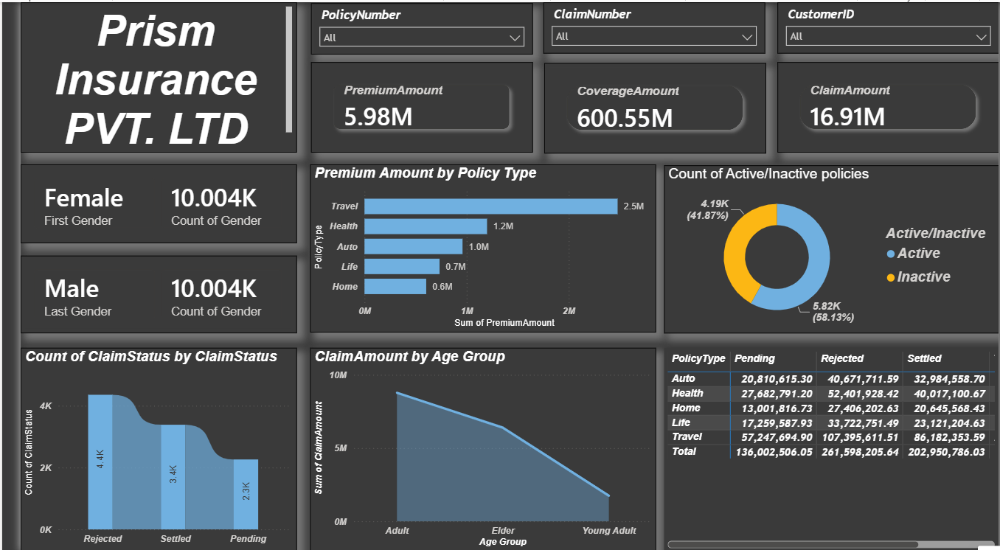

# 📊 Insurance Claims Analytics Dashboard | Power BI

An interactive **Business Intelligence dashboard** built using **Microsoft Power BI** to analyze insurance policies, premiums, claims, customer demographics, and policy performance. This project transforms raw insurance data into meaningful business insights through interactive visualizations and KPI tracking, enabling data-driven decision-making.

---

## 📌 Project Overview

The Insurance Claims Analytics Dashboard provides a comprehensive view of insurance operations by monitoring premium collections, claim settlements, policy distribution, and customer insights. It demonstrates how Power BI can be used to convert raw business data into actionable intelligence for insurance companies.

---

## 🎯 Business Objectives

- Monitor overall premium, coverage, and claim amounts.
- Track claim status (Settled, Pending, Rejected).
- Analyze policy performance by insurance type.
- Compare active and inactive policies.
- Identify customer segments contributing to higher claim amounts.
- Support strategic business decisions through interactive reporting.

---

## 🛠️ Tools & Technologies

- **Microsoft Power BI**
- **Power Query**
- **DAX (Data Analysis Expressions)**
- **CSV & Excel**
- **Data Modeling**
- **Interactive Dashboard Design**
- **Data Visualization**

---

## 📂 Dataset

The project uses insurance policy and customer datasets containing information such as:

- Policy Details
- Customer Information
- Premium Amount
- Coverage Amount
- Claim Amount
- Claim Status
- Policy Type
- Customer Feedback

---

## 📊 Dashboard Features

### Executive KPI Cards

- 💰 Total Premium Amount
- 🛡️ Total Coverage Amount
- 📄 Total Claim Amount

### Interactive Filters

- Policy Number
- Claim Number
- Customer ID

### Interactive Visualizations

- Premium Amount by Policy Type
- Active vs Inactive Policies
- Claim Status Distribution
- Claim Amount by Age Group
- Policy Type Summary
- Customer-Level Insurance Records

---

## 📈 Key Insights

- Travel Insurance generated the highest premium revenue.
- Active policies significantly outnumber inactive policies.
- Rejected claims accounted for the largest share of total claims.
- Adult customers contributed the highest claim amount.
- Premium and claim trends can be monitored dynamically using interactive filters.

---

## 💼 Skills Demonstrated

- Data Cleaning & Transformation
- Data Modeling
- Power Query
- DAX Measures & Calculations
- KPI Development
- Interactive Dashboard Design
- Business Intelligence Reporting
- Data Visualization
- Analytical Thinking
- Business Insights Generation
- Data Storytelling

---
## 📷 Dashboard Preview



---

## 📁 Repository Structure

```
insurance-claims-analytics-dashboard/
│
├── Insurance_Claims_Analytics_Dashboard.pbix
├── InsuranceData.csv
├── Insurance-Customer-Feedback.xlsx
├── dashboard.png
├── README.md
└── LICENSE
```

---

## 🚀 Getting Started

### Clone the Repository

```bash
git clone https://github.com/satyam-katara/insurance-claims-analytics-dashboard.git
```

### Open the Dashboard

Open the following file using **Microsoft Power BI Desktop**:

```
Insurance_Claims_Analytics_Dashboard.pbix
```

---

## 📈 Business Value

This dashboard helps insurance organizations:

- Track premium collection performance
- Monitor insurance claim trends
- Evaluate policy portfolio performance
- Identify high-risk customer groups
- Improve operational decision-making
- Enhance reporting efficiency through interactive dashboards

---

## 🔮 Future Enhancements

- SQL Server Integration
- Automated Data Refresh
- Real-Time Dashboard Updates
- Predictive Claim Analysis
- Insurance Fraud Detection
- Customer Churn Prediction
- Policy Renewal Forecasting

---

## 🌟 Project Highlights

- End-to-End Power BI Dashboard
- Insurance Claims Analytics
- Interactive KPI Reporting
- Dynamic Business Intelligence Dashboard
- Customer & Policy Analytics
- Professional Data Visualization
- Portfolio-Ready Analytics Project

---

## 👨‍💻 Author

**Satyam Katara**

Aspiring Data Analyst | Power BI | SQL | Python | Excel

### Connect with Me

- **GitHub:** https://github.com/satyam-katara

---

## ⭐ If you found this project useful, consider giving it a Star!

---

## 📄 License

This project is created for educational, learning, and portfolio purposes.
